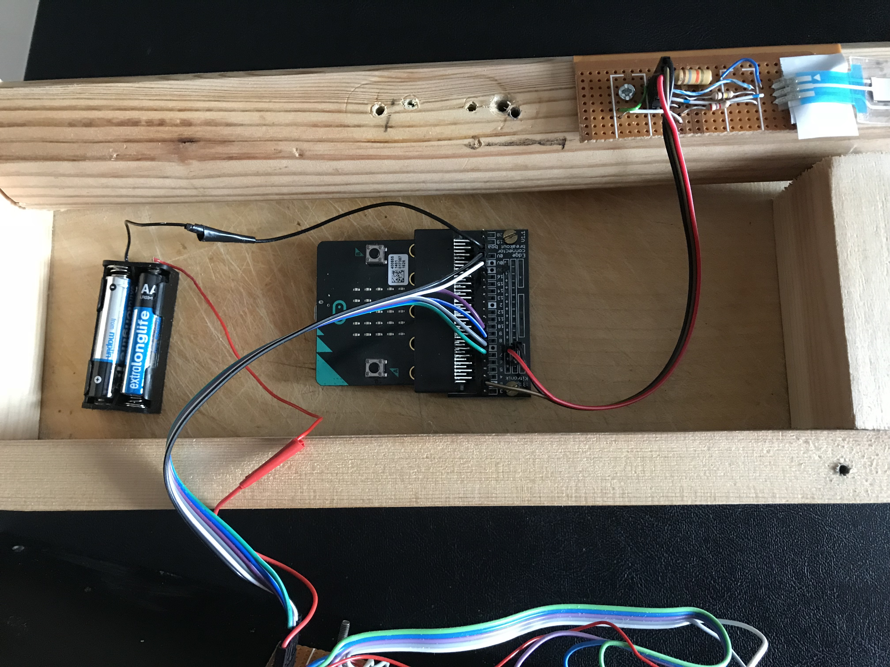

# Overview

The [Micro:bit](http://microbit.org/guide/) is an amazing bit of kit for those of you who like building electronic gadgets and would like to control them using smart phones and tablets. 

It's ability to use Bluetooth Low Energy, it's ease to program and connect external components, makes the Micro:bit an ideal and cheap way to build interfaces.

While I found examples of software running on Android devices that could communicate and control the Micro:bit, I found little on writing for Apple devices such as iPhones and iPads. I decided to address this by writing a module that provides a simple interface between Apple applications and the Micro:bit.

See: [Microbit-Swift](https://phwallen.github.io/microbit-swift/) for information on using the Microbit-Swift and it's associated Playground.

The Micro:bit Musical Instrument Controller is an example of using Microbit-Swift to control an iPhone/iPad application. As you can see from the video I'm not likely to be seen as competing with Stradivari when it comes to building musical instruments, but I hope it demonstrates how a few electronic components can control an iPhone/iPad App.
   

<iframe width="560" height="315" src="https://www.youtube.com/embed/VdGRsR1m2Oo" frameborder="0" allowfullscreen></iframe>

The block diagram below shows the components of the Musical Instrument Controller.

- Sensors and Switches 
- The Micro:bit Control Program
- The Microbit-Swift API
- The Microbit:bit Midi Controller which sends MIDI messages to a MIDI enabled app such as Apple's GarageBand.

Communication between the Micro:bit and iPad is accomplished using Bluetooth Low Energy (BLE) and is facilitated by the **Bluetooth stack** incorporated into the Micro:bit Runtime and **Core Bluetooth** which part of the iOS operating system. 


*Block diagram showing the components of the Micro:bit Musical Instrument*

# Sensors and Switches

 We start with a couple of sensors connected to the micro:bit. 

- The first is a SoftPot Membrane Potentiometer. Pressing down on various parts of the strip linearly changes the resistance. They come in various lengths. The one I'm using is a 500mm one and it's not particularly cheap. The time you paid postage, you'll not likely to see much change from £30. You could liken it to a string on a musical instrument, so because of it's cost, this musical instrument is only going to have one string!

- The second sensor is a Force Sensitive Resistor (FSR), (it's a bit more reasonably priced at around £10). It will act as a sort of volume control or velocity control to use midi terminology. 

In addition, I've added three simple 'push to make buttons' which can control extra functionality, in this example they will activate a pitch bending facility and control the  octave range.

The following shows how I've connected the sensors to the micro:bit.


*Circuit diagram showing the connections to the Micro:bit*

VR1 and VR2 are the the FSR and SoftPot respectively, SW2,SW3,SW4 are the push buttons. The values I used for R1, R2 & R3 are relatively arbitrary using resistors I had to hand that would give me reasonable results. You may like to experiment with different values.

- R1 pulls the end of the FSR connected to pin 1 of the micro:bit down to ground (I've used 18K). This value should be enough to ensure pin 1 is at 0V when no pressure is applied to the FSR.

- R2 provides current limiting protection to the SoftPot. I've read that it's possible, if pressing concurrently at the top and bottom of the membrane to cause it to short and, if there was no limiting resistor, it could damage the SoftPot. These devices cost too much to damage so I've added a 2.7K resistor between the SoftPot and the positive rail. This will slightly decrease the maximum voltage going to Pin 0 of the micro:bit but still gives and adequate range of values from the digital to analogue convertor on the micro:bit.    

- R3 pulls the 'wiper' (middle terminal) of the SoftPot to 3V (I've used 100K). This ensures that when no pressure is applied to the SoftPot, Pin 0 is not left floating and is  kept high. 

All the external components are connected to the micro:bit via a Kitronik Edge Connector Breakout Board.



*The inside of the micro:bit controller* 

# The Control Program

The control program runs in the micro:bit. It's written using the  [Javascript Blocks Editor](https://makecode.microbit.org).


*The Micro:bit (javascript) control program*

By default the editor does not include the Bluetooth package, so you you will need to add it using the **Add Package** option in the Advanced section of the packages list. For further information on how this is done [see this article](https://support.microbit.org/support/solutions/articles/19000062330-using-the-micro-bit-bluetooth-low-energy-uart-serial-over-bluetooth-).

It is recommended that during testing the No Pairing option is selected. To do this, select the cog in the top right of the editor and then select **Project Settings**. Now select - **No Pairing Required: Anyone can connect via Bluetooth.**

The program uses the Bluetooth Event Service to send micro:bit pin values to the iOS application. The same thing could be accomplished using the IO Pin Service, in which case the controller program would simply consist of starting the 'bluetooth io pin service'. I did find, however, that reading values from the SoftPot could be inaccurate probably because too many readings were being taken before the pressure on the device had stabilised. Raising events containing values from an analogReadPin appeared to give more predictable results helped by introducing a delay of 1 millisecond between each read. Also, this approach allows the full range of the micro:bit 10 bit DAC (0 - 1023) to be transmitted where as the io pin service scales the value to be held in a single byte giving a range of 0 - 255.

As the Bluetooth Event Service is enabled by default, no specific bluetooth start command is required.

The program will raise 5 events:

- 9010 - the analogue value (0 - 1023) read from pin 0 which is connected to the SoftPot.
- 9011 - the analogue value (0 - 1023) read from pin 1 which is connected to the FSR.
- 9012 - the digital value of 1 when SW2 is pressed and 0 when SW2 is released.
- 9013 - the digital value of 1 when SW3 is pressed and 0 when SW3 is released.
- 9014 - the digital value of 1 when SW4 is pressed and 0 when SW4 is released.

To prevent unnecessary events being raised a simple filter consisting of checking if the new value on a pin matches its last value is incorporated in the program.   

I thought it might be fun to demonstrate the Bluetooth accelerometer service so I've included a pitch bend facility that bends a note depending on the angle of the controller. From the control program perspective, all that is needed is a startAccelerometerService command. This allows accelerometer data to be transmitted at a rate determined by the iOS application. 

# Microbit-Swift API

Central to this project is to demonstrate the Microbit-Swift application programming interface allowing Apps written for Apple operating systems to communicate with a Micro:bit.

For information about the API see : [Micro:bit Swift Bluetooth LE](https://phwallen.github.io/microbit-swift/).
  
The API is written in the Swift programming language and exploits the Apple Core Bluetooth framework. It's easily installed in any Xcode project by simply copying [Microbit.swift](https://github.com/phwallen/microbit-swift/blob/master/Microbit/Microbit/Microbit.swift) into an Xcode project.

# Micro:bit Midi Controller

The controller is a simple iOS application that exploits the CoreMIDI framework to create a MIDI virtual source  that can be discovered by GarageBand.

The controller constructs MIDI messages -
 
- Note on (0x90)
- Note off (0x80)
- Pitch bend (0xE0)

based on sensor information from the micro:bit and sends the messages to GarageBand via the MIDI virtual source.

The controller communicates with the micro:bit via the **Microbit-Swift API**.

#### Example Microbit-Swift API calls 

The following shows examples of API calls to communicate with the Micro:bit Musical Controller.

##### Initialise a Microbit object. 

```
let microbit = Microbit("BBC micro:bit [tizip]")
```
##### Set a delegate to receive call backs from the API 
```
microbit.delegate = self
```
##### Start looking for the micro:bit named in the Microbit constructor and if found connect to it.
```
microbit.startScanning()
```
##### specify what happens when the Accelerometer and Event services are detected.
- Accelerometer - set a reporting period of 160 milliseconds.
- Event - register the micro:bit events the app is interested in.
```
extension ViewController:MicrobitDelegate {
    func serviceAvailable(service: ServiceName) {
        switch service {
        case .Accelerometer:
            microbit.accelerometer(period: .p160)
        case .Event :
            microbit.registerEvents(events: [9010,9011,9012,9013,9014])
        default :
            break
        }
    }
```
##### specify what happens when the app receives one of the registered events.
- 9010 pressure has been detected on the SoftPot. Using the resistor values specified (see Sensors and Switches above), a value of 0 represents the bottom of the sensor, a value of 900 represents the top of the sensor, a value > 900 means no pressure on the sensor. The values can be used to determine which note or notes (if in chord mode) have been selected facilitating the construction of the appropriate MIDI message(s).
- 9011 pressure has been detected on the FSR. A value of 900 means maximum pressure while 0 means no pressure. The values can be used to determine the velocity specified in the MIDI message.
- 9012 SW2 has been pressed. This is used to toggle the pitch bend facility. 
- 9013 SW3 has been pressed. This is used as an 'octave up' button and influences which MIDI note value should be used.
- 9014 SW4 has been pressed. This is used as an 'octave down' button and influences which MIDI note value should be used.  
```
extension ViewController:MicrobitDelegate {
        func microbitEvent(type: Int16, value: Int16) {
        //print ("Event = \(type) Value = \(value)")
        switch type {
        case 9010 :
            midiController.stringPosition(value: Int(value))
            stringPosLabel.text = String(value)
            noteNameLabel.text = midiController.noteName
        case 9011 :
            midiController.volumePosition(value: Int(value))
            volumeLabel.text = String(value)
        case 9012 :
            if value == 1 {
                if midiController.pitchBendOn {
                    midiController.setPitchBendOff()
                    pitchBendOnLabel.text = "OFF"
                } else {
                    midiController.pitchBendOn = true
                    pitchBendOnLabel.text = "ON"
                }
            }
        case 9013 :
            if value == 1 {
                if midiController.octave < MAX_OCTAVE {
                    midiController.octave += 1
                    modeLabel.text = String(midiController.octave)
                }
            }
        case 9014 :
            if value == 1 {
                if midiController.octave > 0 {
                    midiController.octave -= 1
                    modeLabel.text = String(midiController.octave)
                }
            }
        default :
            print ("Invalid Event")
        }
    }
```
##### Specify what happens when accelerometer data is received.
 In this project only the 'y' value is used to determine the angle of the instrument. If the neck is horizontal the value should be 0, the more the neck is tilted upwards 'y' will increase it's negative value. This value can then be used to construct a MIDI pitch bend message.
```
extension ViewController:MicrobitDelegate {
    func accelerometerData(x: Int16, y: Int16, z: Int16) {
        midiController.pitchPosition(value: Int(y))
        pitchLabel.text = String(y)
    }
```    